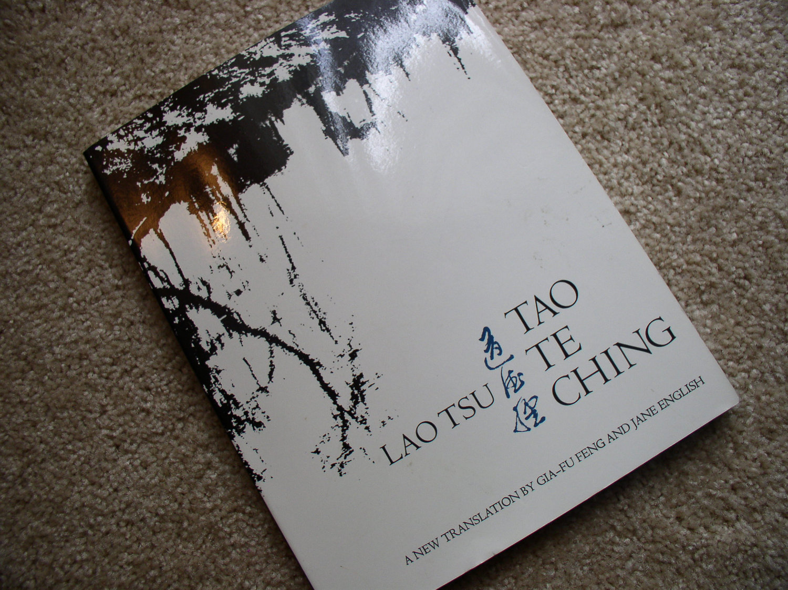

# slides
 
!SLIDE

# Tao of Ruby

# &nbsp;

## kitallis@nilenso.com steven@nilenso.com

!SLIDE

# who are we?

!NOTES

who are we... and why should you listen to us?

!SLIDE

# @kitallis

# @deobald

!NOTES

much of the tao te ching is about time.
kitty is at the beginning of his career, I am at the end of mine.
(I am going to die in a horrifying chemical explosion next year.)

!SLIDE

!SLIDE

!SLIDE

!SLIDE

# what is nilenso?

!NOTES

...a company which employs some of these principles.

!SLIDE

# poem #66

 
... 

Because she does not compete, 
She does not meet competition. 

!SLIDE

# we are a coop.

<table>
<tr>
<td>
<canvas id="canvas" width="600" height="600"></canvas>
</td>
<td>
<table id="owns">
    <tr><th>Partner</th>  <th>Owns</th> </tr>
    <tr><td>Akshay</td>   <td>9</td>  </tr>
    <tr><td>Aninda</td>   <td>9</td>  </tr>
    <tr><td>Asif</td>     <td>9</td>  </tr>
    <tr><td>Jithu</td>    <td>9</td>  </tr>
    <tr><td>Neha</td>     <td>9</td>  </tr>
    <tr><td>Nivedita</td> <td>9</td>  </tr>
    <tr><td>Prashant</td> <td>9</td>  </tr>
    <tr><td>Srihari</td>  <td>9</td>  </tr>
    <tr><td>Steven</td>   <td>9</td>  </tr>
    <tr><td>Tejas</td>    <td>9</td>  </tr>
    <tr><td>Timothy</td>  <td>9</td>  </tr>
</table>
</td>
</tr>
</table>

!SLIDE

# poem #10

 
... 

  Opening and closing the gates of heaven, 
  Can you play the role of woman? 

... 

  Giving birth and nourishing, 
  Bearing yet not possessing, 

...

!SLIDE

# we build bespoke software.

!SLIDE

# poem #64

 
... 

  A tree as great as a man's embrace springs up from a small shoot; 
  A terrace nine stories high begins with a pile of earth; 

... 
        
!SLIDE

# we incubate products.

!SLIDE

# does that mean you should listen to us?

!SLIDE

# . . .

!SLIDE

# let's start!

!SLIDE

<!-- 0. intro -->
#### → what is the tao te ching?
#### → a warning.
<!-- 10 minutes -->
#### → on naming.
<!-- 20 minutes -->
#### → on returning.
<!-- 35 minutes -->
#### → on usefulness.
#### → on effortlessness.
<!-- 45 minutes -->

!SLIDE

#### → what is the tao te ching?
#### → a warning.
#### → on naming.
#### → on returning.
#### → on usefulness.
#### → on effortlessness.

!SLIDE

# 81 poems.

!SLIDE

!NOTES

The myth of Lao Tzu's self-exile.

!SLIDE

# probably not.

!SLIDE

# probably an oral tradition.

!SLIDE

# taoist philosophy (not religion)

# &nbsp;

## nature
## "the way"
## the perfect human

!NOTES

General Taoist philosophy; not just the Tao Te Ching.

Taoist religion is wildly different from Taoist philosophy, and contains a lot of 
magic potions, rituals, and other BS.

The concept of "The Perfect Man" as written about in Taoist literature rarely speaks 
to the process of becoming perfect, but rather the behaviours of those (the wise) 
who have supposedly attained perfection.

!SLIDE

# taoist writing

# &nbsp;

## double entendre
## paradox
## humour
## poetic / musical quality

!SLIDE

# TODO (maybe): one example of each writing utility

!SLIDE

!SLIDE

!SLIDE

# mawangdui manuscripts

# &nbsp;

@@@ ruby
Time.utc(1973)
@@@

!NOTES

...close to the POSIX Epoch. :)

!SLIDE

!SLIDE

@@@ ruby
Time.utc(-168)
@@@

!SLIDE

!SLIDE

#### → what is the tao te ching?
#### → a warning.
#### → on naming.
#### → on returning.
#### → on usefulness.
#### → on effortlessness.

!SLIDE

# poem #1

 

  The Tao that can be told is not the eternal Tao. 
  The name that can be named is not the eternal name. 

The nameless is the beginning of heaven and Earth. 
The named is the mother of the ten thousand things. 
Ever desireless, one can see the mystery. 
Ever desiring, one sees the manifestations. 
These two spring from the same source but differ in name; this appears as darkness. 
Darkness within darkness. 
The gate to all mystery. 

!SLIDE

# only "tao" is permanent

!NOTES

the only permanent thing (or perhaps non-thing) is "tao"

!SLIDE

# whatever we tell you today is inherently flawed and impermanent

!SLIDE

# poem #32

 
The Tao is forever undefined. 
Small though it is in the unformed state, it cannot be grasped. 
If kings and lords could harness it, 
The ten thousand things would come together 
And gentle rain fall. 
Men would need no more instruction and all things would take their course. 

  Once the whole is divided, the parts need names. 
  There are already enough names. 
  One must know when to stop. 
  Knowing when to stop averts trouble. 

Tao in the world is like a river flowing home to the sea. 

!SLIDE

# we (developers) love to talk.

!SLIDE

# we (developers) love to make analogies and comparisons.

!SLIDE

TODO: architecture
TODO: engineering
TODO: gardening
TODO: wizards

!SLIDE

# forgive us.

!SLIDE

#### → what is the tao te ching?
#### → a warning.
#### → on naming.
#### → on returning.
#### → on usefulness.
#### → on effortlessness.

!SLIDE

# poem #32

 
The Tao is forever undefined. 
Small though it is in the unformed state, it cannot be grasped. 
If kings and lords could harness it, 
The ten thousand things would come together 
And gentle rain fall. 
Men would need no more instruction and all things would take their course. 

  Once the whole is divided, the parts need names. 
  There are already enough names. 
  One must know when to stop. 
  Knowing when to stop averts trouble. 

Tao in the world is like a river flowing home to the sea. 

!NOTES

- do we really need to name everything? (lambdas? FRP vs. state/callbacks)
- identifying / naming abstractions

<!-- Game.loop do |enemy| -->
<!--     #enemy.pick_up_gun -->
<!--     #enemy.shoot -->
<!--     enemy.on_pick_up_gun { |e| e.shoot } -->
<!--     enemy.on_shoot {|e| e.die } -->
<!-- end -->

!SLIDE

# poem #25

 
Something mysteriously formed, 
Born before heaven and Earth. 
In the silence and the void, 
Standing alone and unchanging, 
Ever present and in motion. 
Perhaps it is the mother of ten thousand things. 

  I do not know its name 
  Call it Tao. 
  For lack of a better word, I call it great. 

... 

!NOTES

- the difficulty of naming
- concepts without names

!SLIDE

#### → what is the tao te ching?
#### → a warning.
#### → on naming.
#### → on returning.
#### → on usefulness.
#### → on effortlessness.

!SLIDE
 
# poem #2
 
 
... 
Therefore the sage goes about doing nothing, teaching no-talking. 
The ten thousand things rise and fall without cease, 

Creating, yet not owning. 
Working, yet not taking credit. 
Work is done, then forgotten. 
Therefore it lasts forever. 

!SLIDE

!SLIDE

!SLIDE

# poem #9

 
Better to stop short than fill to the brim. 
Oversharpen the blade, and the edge will soon blunt. 
Amass a store of gold and jade, and no one can protect it. 

  Claim wealth and titles, and disaster will follow. 
  Retire when the work is done. 
  This is the way of heaven. 

!SLIDE

# poem #13

 
Accept disgrace willingly. 
Accept misfortune as the human condition. 
What do you mean by "Accept disgrace willingly"? 

  Accept being unimportant. 

Do not be concerned with loss or gain. 
This is called "accepting disgrace willingly." 
What do you mean by "Accept misfortune as the human condition"? 

  Misfortune comes from having a body. 

Without a body, how could there be misfortune? 
Surrender yourself humbly; then you can be trusted to care for all things. 
Love the world as your own self; then you can truly care for all things. 

!NOTES

"body": because we are born, we die. therefore we experience loss.

!SLIDE

# TODO: code example - deleting code

!SLIDE

# poem #2

 

  Under heaven all can see beauty as beauty only because there is ugliness. 
  All can know good as good only because there is evil. 

... 

  Therefore the sage goes about doing nothing, teaching no-talking. 
  The ten thousand things rise and fall without cease, 

Creating, yet not owning. 
Working, yet not taking credit. 
Work is done, then forgotten. 
Therefore it lasts forever. 

!SLIDE

# poem #16

 
Empty yourself of everything. 
Let the mind become still. 

  The ten thousand things rise and fall while the Self watches their return. 
  They grow and flourish and then return to the source. 
  Returning to the source is stillness, which is the way of nature. 
  The way of nature is unchanging. 

Knowing constancy is insight. 
Not knowing constancy leads to disaster. 
Knowing constancy, the mind is open. 
With an open mind, you will be openhearted. 
Being openhearted, you will act royally. 
Being royal, you will attain the divine. 
Being divine, you will be at one with the Tao. 
Being at one with the Tao is eternal. 
And though the body dies, the Tao will never pass away. 

!SLIDE

# poem #23

 
To talk little is natural. 

  High winds do not last all morning. 
  Heavy rain does not last all day. 
  Why is this? Heaven and Earth! 
  If heaven and Earth cannot make things eternal, 
  How is it possible for man? 

He who follows the Tao 
Is at one with the Tao. 
He who is virtuous 
Experiences Virtue. 
He who loses the way 
Is lost. 
When you are at one with the Tao, 
The Tao welcomes you. 
When you are at one with Virtue, 
The Virtue is always there. 
When you are at one with loss, 
The loss is experienced willingly. 
He who does not trust enough 
Will not be trusted. 

!SLIDE

# TODO: stop-motion animations of "static" things (starfield, rotting fruit, something slower?)

!SLIDE

# ( demo/voyeurb.rb )

# TODO: 1. gemify voyeurb 2. voyeurb a camping request

!SLIDE

#### → what is the tao te ching?
#### → a warning.
#### → on naming.
#### → on returning.
#### → on usefulness.
#### → on effortlessness.

!SLIDE

# poem #11

Thirty spokes share the wheel's hub; 
It is the center hole that makes it useful. 

  Shape clay into a vessel; 
  It is the space within that makes it useful. 

Cut doors and windows for a room; 
It is the holes which make it useful. 

  Therefore benefit comes from what is there; 
  Usefulness from what is not there. 

!NOTES

runtime, pointers/references
cpu caches, words in memory, electricity (it is a machine)
implicit data structure? - oop, performance, design friction
abstraction (FRP)

!SLIDE

# TODO: code example - "invisible" abstraction: FRP vs. callback - twitter stream!

!SLIDE

#### → what is the tao te ching?
#### → a warning.
#### → on naming.
#### → on returning.
#### → on usefulness.
#### → on effortlessness.

!SLIDE

# poem #8

 
The highest good is like water. 

  Water give life to the ten thousand things and does not strive. 

It flows in places men reject and so is like the Tao. 
In dwelling, be close to the land. 
In meditation, go deep in the heart. 
In dealing with others, be gentle and kind. 
In speech, be true. 
In ruling, be just. 
In business, be competent. 

  In action, watch the timing. 

No fight: No blame. 

!SLIDE

# poem #28

 
... 
Ever true and resourceful, 
Return to the state of the uncarved block. 
When the block is carved, it becomes useful. 
When the sage uses it, he becomes the ruler. 

  Thus, "A great tailor makes few cuts." 

!SLIDE

# poem #30

Whenever you advise a ruler in the way of Tao, 

  Counsel him not to use force to conquer the universe. 
  For this would only cause resistance. 

Thorn bushes spring up wherever the army has passed. 
Lean years follow in the wake of a great war. 
Just do what needs to be done. 
Never take advantage of power. 
Achieve results, 
But never glory in them. 
Achieve results, 
But never boast. 
Achieve results, 
But never be proud. 
Achieve results, 
Because this is the natural way. 

  Achieve results, 
  But not through violence. 
  Force is followed by loss of strength. 
  This is not the way of Tao. 
  That which goes against the Tao comes to an early end. 

!SLIDES

# but how?

!SLIDE

# 1. stop the violence. stop striving.

!SLIDE

- late nights?
- working weekends?
- no time to fix your tools?
- no time to automate your processes?

!SLIDE

# 2. remove difficulties.

!SLIDE

!SLIDE

# "Why Maybe is Better Than Null"

# &nbsp;

!SLIDE

@@@ ruby
module Enumerable
  def only_by_block &block
    bomb "can't take only of empty list" if empty?
    values = select(&block)
    bomb "can't take only of multiple matching values" if values.size > 1
    bomb "can't take only of no matching values in" if values.empty?
    bomb_nil_delayed(values.first) {"can't take only and get nil"}
  end
  private :only_by_block

  def only &block
    return only_by_block(&block) if block_given?
    bomb "can't take only of multiple values" if size > 1
    bomb "can't take only of empty list" if empty?
    bomb_nil_delayed(first) {"can't take only and get nil"}
  end
  # ....
end

[1, 2, 3, 4].only #=> bomb("can't take only of multiple values")
[].only #=> bomb("can't take only of empty list")
["deobald", "kitallis", "kiran"].only do |name|
  name.start_with? "k"
end #=> bomb("can't take only of multiple matching values")
@@@

!NOTES

TODO: research/explain `bomb`

!SLIDE

# 3. baby steps.

!NOTES

Chuang Tzu's "Dextrous Butcher":

There is a story of Cook Ting, cook to Lord Wen-hui. Ting seemed to carve meat as if by magic. Wen-hui asked him how he could possibly achieve such skill.

"What I care about is the Way, which goes beyond skill.

"A good cook changes his knife once a year - because he cuts. A mediocre cook changes his knife once a month - because he hacks. I've had this knife of mine for nineteen years and I've cut up thousands of oxen with it, and yet the blade is as good as though it had just come from the grindstone. There are spaces between the joints, and the blade of the knife has really no thickness. If you insert what has no thickness into such spaces, then there's plenty of room - more than enough for the blade to play about it.

"However, whenever I come to a complicated place, I size up the difficulties, tell myself to watch out and be careful, keep my eyes on what I'm doing, work very slowly, and move the knife with the greatest subtlety, until - flop! the whole thing comes apart like a clod of earth crumbling to the ground. I stand there holding the knife and look all around me, completely satisfied and reluctant to move on, and then I wipe off the knife and put it away.

!SLIDE

# poem #64

 
... 
Deal with it before it happens. 
Set things in order before there is confusion. 
A tree as great as a man's embrace springs up from a small shoot; 
A terrace nine stories high begins with a pile of earth; 

  A journey of a thousand miles starts under one's feet. 

!SLIDE

# 4. meaningful practice.

!SLIDE

TODO: cut up the alan kay tennis video, add subtitles, highlight important words?

- 1:41 - 1:58 ("bounce, hit.")
- 2:38 - 2:48 (hitting)
- blank: series of drills like this, watching then doing. / next, plays a game.
- 7:20 - 7:24 ("everything became effortless.")
- 8:00 - 8:26 ("something I wouldn't have believed possible.")
- blank: editor/language is a user interface
- 9:45 - 10:18 ("hitting vs. chasing")

!NOTES

"chasing the ball"

- editing repetitive code instead of creating an abstraction for structural duplication
- puts'ing values and re-running your app manually instead of TDD/repl
- using a debugger to observe state changes instead of removing them from your program's flow

!SLIDE

### BIBLIOGRAPHY
    
- http://www.geekfarm.org/cgi-bin/tao.pl
- http://en.wikipedia.org/wiki/Mawangdui_Silk_Texts
- http://nickknowlson.com/blog/2013/04/16/why-maybe-is-better-than-null/
- http://startingdotneprogramming.blogspot.in/2013/04/i-knew-programmer-that-went-completely.html
- http://samsaffron.com/archive/2013/05/03/eliminating-my-trivial-inconveniences
- https://github.com/nilenso/voyeurb

!SLIDE

### THANKS!

#### github.com/nilenso/tao-of-ruby-talk  
@kitallis / @deobald
